## 概述

本项目为CSUWeb课程实验，登录页面的简单全栈系统。

## 功能描述

### 1、前端页面的基本布局

1. 布局类似于学校门户：[中南大学统一身份认证平台](http://my.csu.edu.cn/login/index.jsp) 
2. 顶部需有 LOGO 栏目；
3. 左侧提供轮播图；
4. 提供账号密码登录方式；
5. 提供手机号码（邮箱）+验证码登录方式；
6. 登录成功后跳到显示“登录成功”四字的页面（简单设计）；
7. 提供忘记密码和修改密码功能；
8. 提供用户的增删改查。 

### 2、完成前后端数据交互

### 3、数据操作要求：

1. 数据统一存储在后端数据库中；
2. 账号密码登录方式需进行验证，验证通过方能登录；
3. 手机验证码、邮箱验证码需调用第三方短信接口发送验证码并进行验证；

## 效果展示

用户登录：

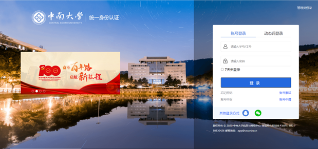

账号密码登录：

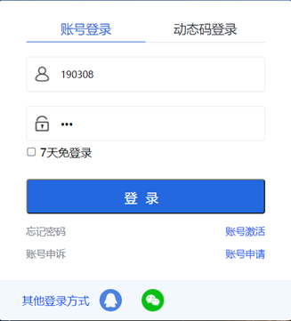

提示错误信息：

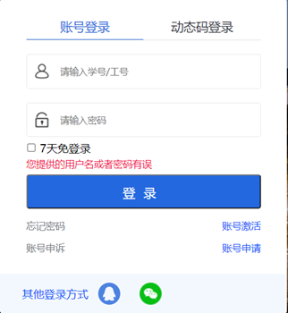

动态码登录：

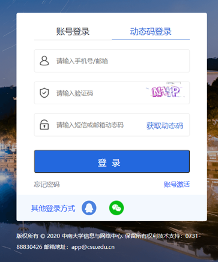

登录成功后的页面：

修改密码：

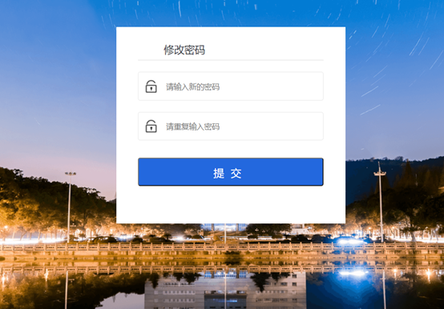

忘记密码：

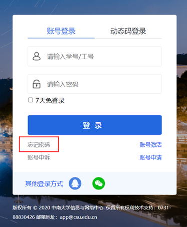

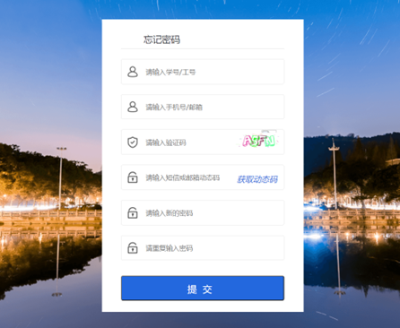

管理员登录：

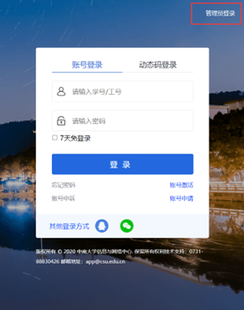

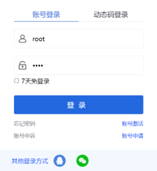

管理员登录成功界面：

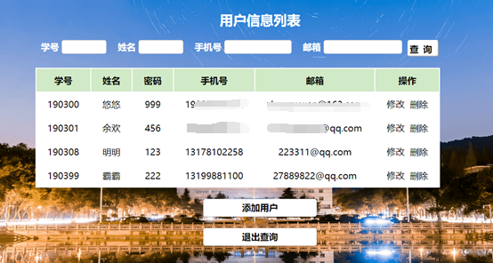

查询用户：

添加用户：

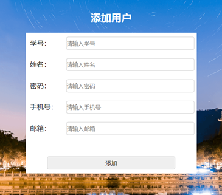

修改用户信息：

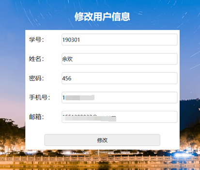

